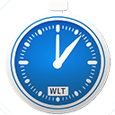

# TimeTracker - Chrome Extension

Tracks the time spent on a website and displays it in a popup window.
The time is saved in the sync storage of the browser.
The time is displayed in a popup window and can be reset by clicking
on the reset button. The time is also displayed in the extension icon.
The extension icon can be clicked to open the popup window.
You can change the time format (seconds, minutes, hours, days) in the
options window. You can also add a website to the important websites
list and many more from the options window.
 

## Installation

Installing the project on Chrome browser
1. Open a browser
2. Go to chrome: **//extensions/**
3. Enable developer mode
4. Click on "Load unpacked"
5. Select the folder of the project
6. The extension should be installed

Installing the project on Firefox browser
1. Open a browser
2. Go to firefox: **//about:debugging#/runtime/this-firefox**
3. Click on "Load Temporary Add-on"
4. Select the manifest.json file of the project
5. The extension should be installed
    
## Usage/Examples

1. Open a browser
2. Install the extension
3. Go to a website
4. Click on the extension icon
5. You should see the time spent on every website that you've visited

## Features

- Turn off/on the time tracking
- Reset the time spent on a website
- Display the time spent on a website
- Display the time spent on every website that you've visited
- Display the time spent on every website that you've visited in a chart
- Change the time format (seconds, minutes, hours, days)
- Add a website to the important websites list
- Remove a website from the important websites list
- Display the time spent on every important website that you've visited
- Display the time spent on every important website that you've visited in a chart
- Edit the domain of important website

## Credits
Chart CSS library - https://chartscss.org/